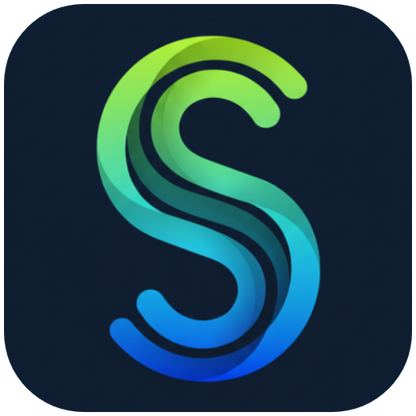
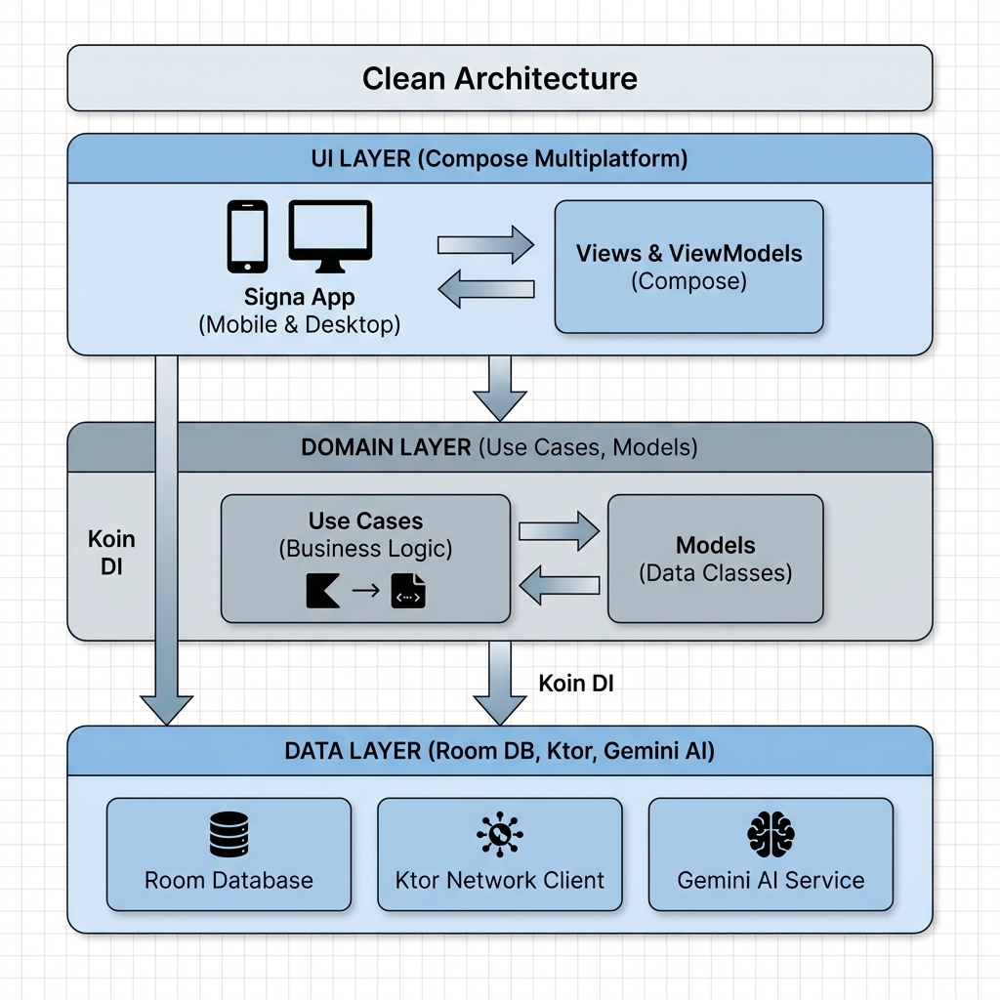
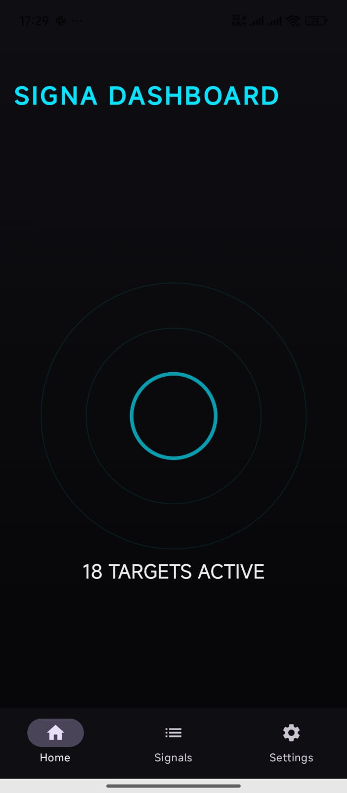
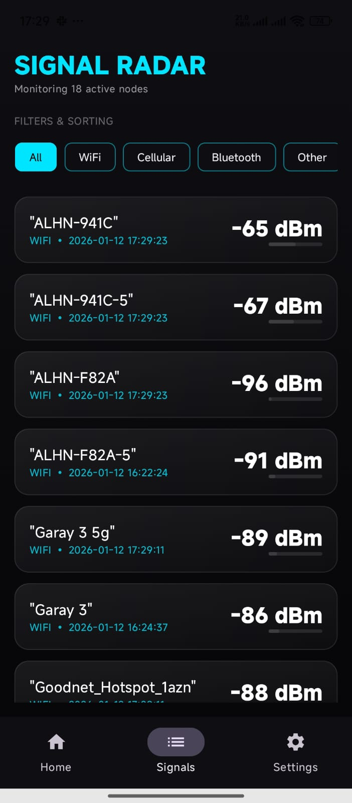
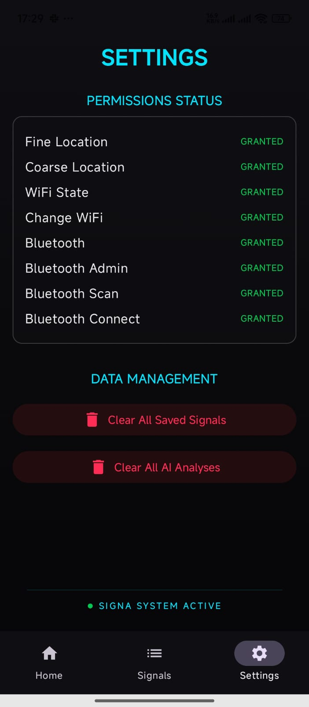
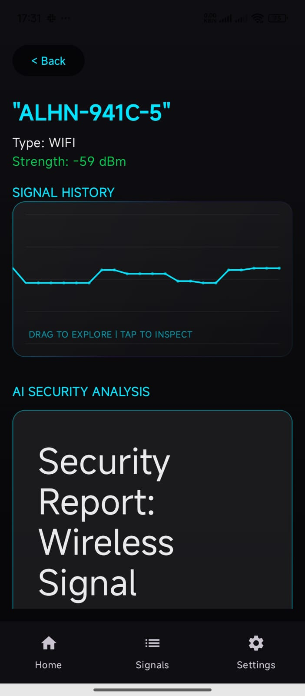
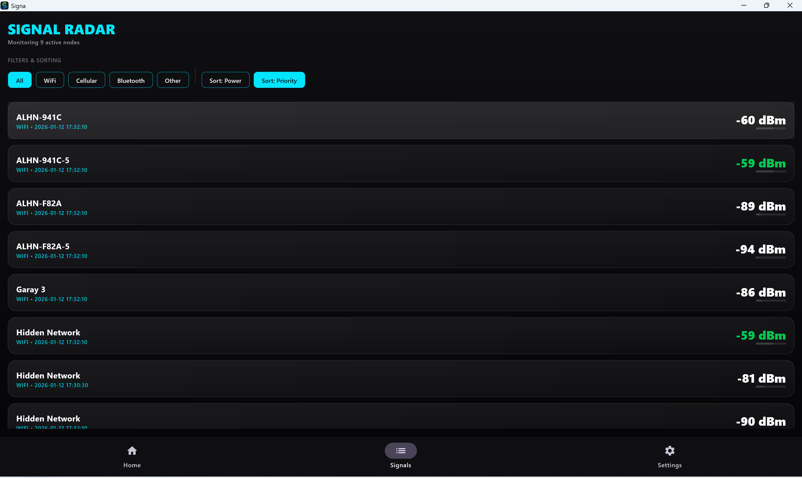
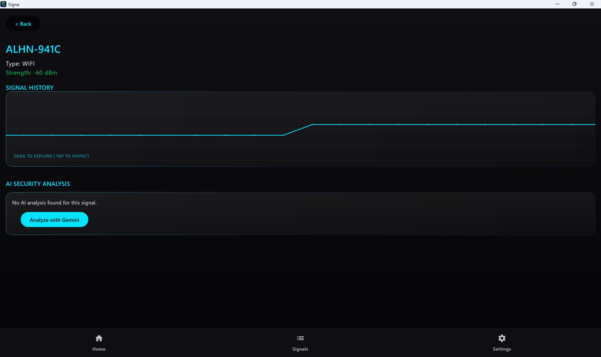

<p align="center">
  
</p>

<h1 align="center"><strong>Signa</strong> - Real-time Signal Intelligence & Security</h1>

<p align="center">
  <a href="https://kotlinlang.org"></a>
  <a href="https://www.jetbrains.com/lp/compose-multiplatform/"></a>
  <a href="LICENSE"></a>
  <a href="https://kotlinconf.com"></a>
</p>

---

## Android Demo Video

<p align="center">
  <video src="https://github.com/user-attachments/assets/d30bcb5e-b677-4791-ad4a-fc992113e433
" width="320" controls>
  </video>
</p>

---

**Signa** is a powerful, cross-platform signal monitoring and analysis tool built with **Kotlin Multiplatform**. It allows users to detect, track, and analyze surrounding radio signals in real-time, providing deep insights and security audits powered by **Gemini AI**.

Developed for the **KotlinConf Contest**, Signa demonstrates the power of modern Kotlin development by delivering a high-performance, beautiful UI experience across **Android, Windows, macOS, and Linux**.

---

## Demo Videos

Experience Signa in action across different platforms:

| Platform | Video Link |
| :--- | :--- |
| **Android** | [Watch Demo](https://drive.google.com/file/d/1OA3o3yQykAlOp_CjbjrDYKeYCCLpPviO/view?usp=drive_link) |
| **Windows** | [Watch Demo](https://drive.google.com/file/d/1JD1590c8OYlJHVHiasYhlQdU9yy22eii/view?usp=drive_link) |
| **Full Folder** | [Google Drive Folder](https://drive.google.com/drive/folders/1zjLoIuF3QCKfW6XrGXiOW52zIDFiExxp?usp=drive_link) |

---

## Latest Releases

Download the latest version of Signa for your platform:

| Platform | Download Link |
| :--- | :--- |
| **Android** | [Download APK](https://github.com/Camalzadeh/signa/releases/download/v2026.01.12-1635/composeApp-release.apk) |
| **Windows** | [Download EXE](https://github.com/Camalzadeh/signa/releases/download/v2026.01.12-1635/org.signa.app-1.0.0.msi) |
| **macOS** | [Download DMG](https://github.com/Camalzadeh/signa/releases/download/v2026.01.12-1635/org.signa.app-1.0.0.dmg) |
| **Linux** | [Download DEB](https://github.com/Camalzadeh/signa/releases/download/v2026.01.12-1635/org.signa.app_1.0.0-1_amd64.deb) |

> [!TIP]
> You can find all versions and release notes in the [GitHub Releases](https://github.com/Camalzadeh/signa/releases) page.

---

## Key Features

- **Real-time Signal Scanning**: Monitor environmental signals as they happen.
- **AI-Powered Security Analysis**: Integrated **Gemini AI** to analyze signal risks and detect potential threats (hidden cameras, suspicious trackers, etc.).
- **Interactive Data Visualization**: Smooth, interactive charts to analyze signal strength and frequency history.
- **Local Persistence**: Full **Room Database** integration to store and manage signal history offline.
- **Smart Filtering & Sorting**: Easily find specific signals based on type, strength, or security status.
- **Premium UI/UX**: Built with **Compose Multiplatform** for a fluid, modern interface that adapts to mobile and desktop.

---

## Tech Stack

Signa is built using the latest industry standards for Kotlin development:

- **Language**: [Kotlin](https://kotlinlang.org/) (KMP)
- **UI Framework**: [Compose Multiplatform](https://www.jetbrains.com/lp/compose-multiplatform/)
- **Architecture**: Clean Architecture (Data, Domain, UI layers)
- **Dependency Injection**: [Koin](https://insert-koin.io/)
- **Database**: [Room KMP](https://developer.android.com/kotlin/multiplatform/room)
- **Networking**: [Ktor Client](https://ktor.io/)
- **AI Integration**: [Google Gemini AI](https://ai.google.dev/) (Direct AI Integration)
- **Concurrency**: [Kotlin Coroutines](https://kotlinlang.org/docs/coroutines-overview.html) & [Flow](https://kotlinlang.org/docs/flow.html)

---

## Architecture Diagram

Signa follows **Clean Architecture** principles to maintain a separation of concerns and ensure the codebase remains scalable and testable.

<p align="center">
  
</p>

---

## Screenshots

### Android
<p align="center">
  
  
  
  
</p>

### Windows
<p align="center">
  
  
</p>

---

## Getting Started

### Prerequisites
- JDK 17 or higher
- Android Studio Koala+ or IntelliJ IDEA
- Kotlin 2.1.0

### Installation
1. Clone the repository:
   ```bash
   git clone https://github.com/Camalzadeh/signa.git
   ```
2. Open in Android Studio or IntelliJ IDEA.
3. **No Setup Required**: For the convenience of the **KotlinConf Contest** judges, a demo **Gemini API Key** is already hardcoded in the `dataModule`. You do **not** need to configure `local.properties` to test the AI features.
4. **Build and Run**:
   - **Android**: Select the `composeApp` configuration and click **Run**.
   - **Desktop**: Run the Gradle task: `./gradlew :composeApp:run`

---

## How to Use

1. **Scan**: Upon launching, the app automatically begins scanning for nearby signals (WiFi/Bluetooth). Observe the real-time list of detected devices.
2. **Select**: Tap any specific signal to open the **Detail View** and see its frequency and strength history.
3. **Analyze**: In the Detail View, press the **"Analyze with Gemini"** button. The AI will process the signal data and generate a security report regarding potential risks.
4. **History**: All scanned signals are automatically saved to the local **Room Database**, allowing you to review them even after restarting the app.

---

## Application Essay

> [!TIP]
> This project was developed by **Humbat Jamalov** (Computer Science student at UFAZ) as a journey to master Kotlin Multiplatform while bridging the gap between Signal Processing and AI.

### Abstract
Signa was born from a fascination with invisible radio signals and the security risks they pose to our daily devices. By leveraging **Kotlin Multiplatform** and **Gemini AI**, this project transforms raw hardware data into actionable security intelligence. Whether it is identifying unauthorized access points or detecting suspicious trackers, Signa empowers users with real-time signal visibility and automated AI audits.

For a detailed look into the developer's journey—from a Flutter/Django background to mastering KMP—and the future roadmap involving Fourier Transforms and secure messaging protocols, please refer to the full essay:

**[Read the Full Essay: Bridging Signal Intelligence and AI](docs/essay.md)**

---

## License

This project is licensed under the BSD 3-Clause License - see the [LICENSE](LICENSE) file for details.

---

## KotlinConf Contest
Signa is proudly submitted as an entry for the **KotlinConf Contest**. It showcases the versatility of Kotlin Multiplatform in building security-focused, AI-integrated applications for the modern world.

Developed by **Humbat Jamalzadeh**.
